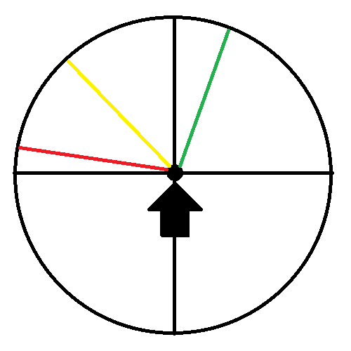

# Karate

## Algemeen

### Termen

Uchi = naar binnen

Soto = naar buiten

### Taisabaki en richting

De zwarte pijl is de richting vanuit waar de tegenstander komt. Het aantal graden voor Taisabaki is gebaseerd op het
verschil van de richting waar je uitstapt. Bijvoorbeeld bij rood stap je uit naar de zijkant met links, maar je stapt
niet precies
90 graden uit. Ten opzichte van de zwarte lijn zit er ongeveer een verschil van 10 graden naar achteren in.

Rood = Taisabaki naar de zijkant, 10 graden naar achteren

Geel = Taisabaki schuin naar achteren, 45 graden

Groen = Taisabaki naar achteren, 30 graden naar rechts

## Sonoba Kihon

Technieken stilstaand

### Seme Waza

Stoten en slagen

| Nummer                                  | Naam             | Omschrijving                                                                                                                                                                                                                                                                       |
|-----------------------------------------|------------------|------------------------------------------------------------------------------------------------------------------------------------------------------------------------------------------------------------------------------------------------------------------------------------|
| **1** | Tateken          | Stoot, knokkels niet naar boven maar naar de zijkant                                                                                                                                                                                                                               |
| **2** | Uraken           |                                                                                                                                                                                                                                                                                    |
| **3** | Shuto Uchi       | Arm licht gebogen, open hand, palm naar de onderkant; andere hand gesloten als vuist in de zij, palm naar de onderkant; gesloten hand open, achter de oor, palm naar achter; slag, arm licht gebogen, open hand, palm naar de onderkant; andere hand gesloten als vuist in de zijn |
| **4** | Kagite / Furiken | Hoek stoot, op moment van contact arm terughalen                                                                                                                                                                                                                                   |

### Uke Waza

Blokken

| Nummer                                  | Naam        | Omschrijving                                                  |
|-----------------------------------------|-------------|---------------------------------------------------------------|
| **1** | Joden Uke   | Hoge blok                                                     |
| **2** | Gedam Barai | Lage blok                                                     |
| **3** | Uchi Uke    | Blok van buiten naar binnen; ontspannen; blok voorbij gezicht |
| **4** | Soto Uke    | Blok van binnen naar buiten                                   |

### Tewaza

Stoten op kussen

| Nummer                                  | Naam      | Omschrijving |
|-----------------------------------------|-----------|--------------|
| **1** | Junzuki   |              |
| **2** | Gyakuzuki |              |
| **3** | Uraken    |              |
| **4** | Empi      | Elleboog     |

### Ashi Waza

Trappen op kussen

| Nummer                                  | Naam              | Omschrijving                                                               |
|-----------------------------------------|-------------------|----------------------------------------------------------------------------|
| **1** | Maegeri           |                                                                            |
| **2** | Mawashigeri       |                                                                            |
| **3** | Hizageri          | Knie                                                                       |
| **4** | Tsugi-Ashi Sokuto | Zijwaartse trap; hoek van 90 graden op het kussen; klein beetje bijstappen |

## Ido Kihon

Technieken in beweging

Stoten, i.c.m. Kette ook een trap.

| Nummer                                  | Naam                  | Omschrijving                                                         |
|-----------------------------------------|-----------------------|----------------------------------------------------------------------|
| **1** | Junzuki               | Stap; stoot met voorste hand                                         |
| **2** | Gyakuzuki             | Stap; stoot met achterste hand                                       |
| **3** | Junzuki No Tsukkomi   | Supermanstoot; goed diep staan                                       |
| **4** | Gyakuzuki No Tsukkomi | Brede stand; zwaartepunt lichaam boven voorste been stoot naar navel |

### Keri Waza

Trappen

| Nummer                                  | Naam            | Omschrijving                                 |
|-----------------------------------------|-----------------|----------------------------------------------|
| **1** | Maegeri         | Voorwaartse trap                             |
| **2** | Mawashigeri     | Draaitrap; tijdens de draai trap met wreef   |
| **3** | Sokuto          | Zijwaartse trap                              |
| **4** | Ushirogeri      | Achterwaartse trap; gelijk draai en dan trap |
| **5**  | Ura-Mawashigeri | Draaitrap; na draai hoek met hiel            |

### Renraku Waza

Combinaties

| Nummer                                  | Naam                                         | Omschrijving                                                    |
|-----------------------------------------|----------------------------------------------|-----------------------------------------------------------------|
| **1** | Maegeri, Gyakuzuki                           |                                                                 |
| **2** | Mawashigeri, Guyakuzuki                      |                                                                 |
| **3** | Maegeri, Mawashigeri, Gyakuzuki              |                                                                 |
| **4** | Maegeri, Mawashigeri, Uraken, Gyakuzuki      |                                                                 |
| **5** | Surikomi sokuto, Uraken, Gyakuzuki           | Slip stap voren; sokuto (zijwaartse trap)                       |
| **6** | Tsugi ashi mawashigeri, Tsugi ashi gyakuzuki | Bijstappen; mawashigeri met voorste voet; bijstappen; Gyakuzuki |                     

## Kumite

Partneroefeningen

### Ippon Kumite Tsuki Uke

Blok op stoot + tegenstoot.

Voor de stoten als aanvaller uitstappen met een Junzuki (licht). Daarna aanval uitvoeren. Aanval altijd met rechts.

Outside = Buitenkant van het lichaam, kan aanvallen in de zij.

Inside = Binnenkant van het lichaam, kan aanvallen op de buik en torso.

| Nummer                                  | Naam                 | Aanvaller              | Verdediger                                                                                                                                                                                                                                                                           |
|-----------------------------------------|----------------------|------------------------|--------------------------------------------------------------------------------------------------------------------------------------------------------------------------------------------------------------------------------------------------------------------------------------|
| **1** | Jodan Uke            | Junzuki richting hoofd | Taisabaki stap naar achter; zelfde voet voor; Jodan Uke; instappen; stoot op de buik                                                                                                                                                                                                 |
| **2** | Gedan Barai          | Junzuki richting buik  | Taisabaki binnenkant schuin naar achter, 45 graden ; Gedan Barai; instappen; hand boven elleboog tegenstander; stoot op de zij; hand bij vuist tegenstander                                                                                                                          |
| **3** | Otoshi Uke - outside | Junzuki richting buik  | Taisabaki buitenkant, naar achter, klein beetje uitstappen, 30 graden naar rechts; blok van boven naar beneden; stoot op het hoofd; hand boven elleboog tegenstander; instappen; stoot op de zij. Blok en stoot op het gezicht in 1 vloeiende beweging (wieltje)                     |
| **4** | Otoshi Uke - inside  | Junzuki richting buik  | Taisabaki binnenkant, naar de zijkant, klein beetje uitstappen, 10 graden naar achteren; blok van boven naar beneden; stoot met links op de lichaam; stoot met links op het hoofd; instappen; hand boven elleboog tegenstander; stoot op op het lichaam; hand bij vuist tegenstander |

### Ippon Kumite Keri Uke

Blok op trap + tegenstoot.

Voor de trappen als aanvaller uitstappen in Kamae. Daarna aanval uitvoeren. Aanval altijd met rechts.

Outside = Buitenkant van het lichaam, kan aanvallen in de zij.

Inside = Binnenkant van het lichaam, kan aanvallen op het lichaam.

| Naam      | Omschrijving                                |
|-----------|---------------------------------------------|
| Harai Uke | Vegende blok, waarbij je het been mee neemt |

| Nummer                                  | Naam                     | Aanvaller                    | Verdediger                                                                                                                                                                                                                          |
|-----------------------------------------|--------------------------|------------------------------|-------------------------------------------------------------------------------------------------------------------------------------------------------------------------------------------------------------------------------------|
| **1** | Uchi Harai Uke - outside | Maegeri                      | Taisabaki buitenkant, naar achter, klein beetje uitstappen; 30 graden naar rechts; Harai Uke, met open hand; hand boven elleboog tegenstander; licht instappen; stoot op de zij                                                     |
| **2** | Uchi Harai Uke - inside  | Maegeri                      | Taisabaki binnenkant, naar achter, klein beetje uitstappen; 30 graden naar links; Harai Uke, met open hand; soort van Uraken op de buik; hand bij vuist tegenstander; stoot naar het hoofd                                          |
| **3** | Soto Harai Uke - outside | Naar voren schuiven, maegeri | Taisabaki buitenkant, schuin naar achter, 45 graden; Harai Uke, met gesloten hand; stoot naar het hoofd; hand boven elleboog tegenstander; instappen; stoot op de zij.                                                              |
| **4** | Soto Harai Uke - inside  | Naar voren schuiven, maegeri | Taisabaki binnenkant, schuin naar achter, 45 graden; Harai Uke, met gesloten hand; stoot met links op het hoofd; stoot met links op de lichaam; hand boven elleboog tegenstander; stoot op het lichaam; hand bij vuist tegenstander |

### Seme Kumite

Aanvallen waarbij de tegenstander stil staat.

| Nummer                                  | Naam    | Verdediger | Aanvaller                                                                                                                                                                                                                  |
|-----------------------------------------|---------|------------|----------------------------------------------------------------------------------------------------------------------------------------------------------------------------------------------------------------------------|
| **1** |         |            |                                                                                                                                                                                                                            |
| **2** |         |            |                                                                                                                                                                                                                            |
| **3** | Uraken  | Kamae      | Instappen; Uraken op vuist tegenstander; verder instappen, lichaam draaien; stoot met links op het hoofd; 90 graden draaien; hand boven elleboog tegenstander; stoot op de zij                                             |
| **4** | Tateken | Kamae      | Instappen, heel licht naar de binnenkant; hand op vuist tegenstander, licht vuist tegenstander naar je toe trekken; stoot op het hoofd; verder instappen; hand bij vuist tegenstander; lichaam draaien; stoot op het hoofd |

### Taoshi Kumite

Takedown

| Nummer                                  | Naam           | Aanvaller                                   | Verdediger                                                                                                                                                                                                                                                                              |
|-----------------------------------------|----------------|---------------------------------------------|-----------------------------------------------------------------------------------------------------------------------------------------------------------------------------------------------------------------------------------------------------------------------------------------|
| **1** |                |                                             |                                                                                                                                                                                                                                                                                         |
| **2** |                |                                             |                                                                                                                                                                                                                                                                                         |
| **3** | Nagashi Uke    | Naar voren schuiven, gyakazuki op het hoofd | Taisabaki buitenkant, schuin naar achter, 45 graden; Nagashi Uke; hand achter elleboog tegenstander; instappen; stoot met rechts op de zij; veeg met links bij linkerbeen tegenstander. Nagashi Uke is als Uchi Uke, maar dan met open hand en je neemt de arm van de tegenstander mee. |
| **4** | Uchi Harai Uke | Maegeri                                     | Taisabaki buitenkant, schuin naar achter, 45 graden; Harai Uke, met open hand; hand achter elleboog tegenstander, instappen, stoot met rechts op  de zij; pak beetpakken; vuist draaien; met rechtervoet naar rechts stappen; trek aan arm; veeg met links                              |

### Goshin Jutsu Kumite

Bevrijdingen

| Nummer                                  | Naam      | Start                                                                               | Verdediger                                                                                                   |
|-----------------------------------------|-----------|-------------------------------------------------------------------------------------|--------------------------------------------------------------------------------------------------------------|
| **1** |           |                                                                                     |                                                                                                              |
| **2** |           |                                                                                     |                                                                                                              |
| **3** | Sode Dori | Verdediger stapt uit met rechts, aanvaller pakt met links het pak boven de elleboog | Licht naar buiten stappen; arm omhoog; draai bovenlichaam naar binnen; arm naar binnen; Gedan Barai          |
| **4** | Mune Dori | Aanvaller pakt met links pak bij de borst aan de linkerkant                         | Hand tegenstander bij de pols beetpakken; Taisabaki buitenkant, naar de zijkant; Uchi Uke achter de elleboog |
